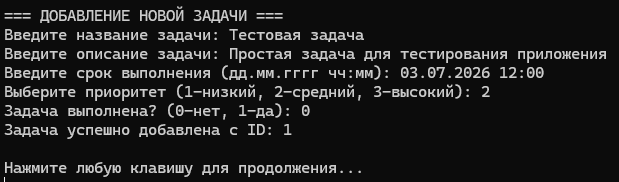
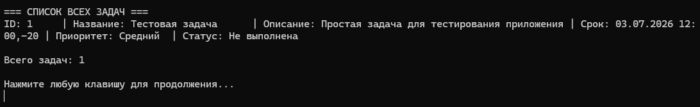
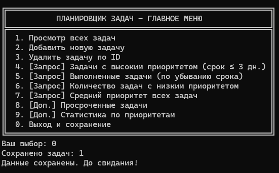

# Красных Александр ИТС-2 Лабораторная №8

# Задание 1

### Текст задачи

Разработать консольное приложение с дружественным интерфейсом с возможностью выбора
заданий для работы с «базой данных (БД)», хранящейся в бинарном файле. Перечень полей
(минимум 5), достаточно полно характеризующих заданную в варианте предметную область,
предложить самостоятельно (постараться отразить в перечне полей такие, которые требуют разных
типов данных). Приложение должно выполнять следующие функции:
1. Чтение базы данных из бинарного файла.
2. Просмотр базы данных.
3. Удаление элементов (по ключу).
4. Добавление элементов.
5. Реализация 4 запросов (формулировки запросов придумать самостоятельно). 2 запроса
должны возвращать перечень, 2 запроса одно значение.
В классе должны присутствовать свойства, конструкторы, перегруженный метод ToString(). Весь
функционал приложения реализовать в виде методов вспомогательного класса с помощью LINQзапросов.
Предусмотреть обработку возможных ошибок при работе программы.

### Алгоритм решения

1. Для выполнения этой задачи нам нужно будет реализовать большое количество классов
2. Начнем с основного класса Task, в нем нам необходимо задать поля которые будут
у каждой нашей задачи, вроде id задачи, ее названия, описания и т.д и конструкторы. Также в этом
классе реализуем перегрузку ToString которая будет выводить нам задачу одной строкой
в которой будет все о задаче.
3. Займемся проверкой введенных значений через вспомогательный класс InputValidator. В
нем будет проверяться коректность ввода всех данных, таких как числа, даты и не пустое ли поле.
4. Теперь займемся работой с бинарным файлом в классе TaskFileManager. Именно в нем будет
реализована работа с файлом. Запись и чтение данных из бинарного файла, а так же методы
для его обнаружения.
5. Ну а теперь реализуем работу с базой данных. Класс TaskService нам наобходим для любых
действий с базой, таких как: запись задач, удаления по id, просмотр всех задач, а также
4 (даже 6) запросов для 5 пункта задания.
6. Финишная прямая. Напишем пользовательский интерфейс. Для этого нам понадобится класс TaskMenu.
Здесь будет реализовано меню нашего приложения, меню ввода задач и все остальные подменюшки
в которых содержится информация. Часть выводов реализована прямо в классе, другая же является
методами иных классов.
7. По ходу разработки я столкнулся с проблемой вывода даты. Напишем для этого небольшой
класс который поможет правильно форматировать и выводить нужные даты. Назовем его DateTimeHelper.
Перенесем сюда большую часть работы с датами такую как: Форматирование, проверка сегодняшняя ли
дата или завтрашняя ли, получение дней до указанной даты и тому подобное.
8. Осталось лишь протестировать готовое приложение, приложу несколько скриншотов тестов.

### Тестирование

